# AlgoArmy Proctoring & System Readiness Architecture

We have implemented a real-time, state-of-the-art **AI proctoring and system permissions verification** workflow. It guarantees candidate integrity before and during all Online Assessments (OAs).

---

## 🛠️ Architecture Workflow

```mermaid
sequenceDiagram
    autonumber
    actor Candidate as Candidate
    participant CheckPage as System Check Page
    participant Workspace as OA Workspace
    participant Server as Backend API (Express)
    participant DB as MongoDB (OALog)

    Candidate->>CheckPage: Clicks "Start Assessment"
    rect rgb(20, 30, 50)
        note right of CheckPage: Candidate grants Camera, Mic, Screen Share, Fullscreen
        CheckPage->>CheckPage: Renders live Webcam feedback preview
        CheckPage->>CheckPage: Computes diagnostic completion percentage
    end
    CheckPage->>Server: POST /api/oa/:id/log-setup (Browser/OS audit)
    Server->>DB: Stores setup audit trace
    CheckPage->>Workspace: Redirects candidate to workspace
    
    rect rgb(30, 20, 20)
        note over Workspace, Server: Real-Time Proctoring Stream Active
        Candidate->>Workspace: Triggers violation (e.g. tab switch)
        Workspace->>Server: POST /api/oa/:id/log-violation
        Server->>DB: Appends violation event & increments counter
        Server-->>Workspace: Returns active violationCount
    end

    alt violationCount >= 5
        Workspace->>Server: POST /api/oa/:id/submit (Auto-submit solutions)
        Workspace->>Workspace: Redirects to Submitted screen
    end
```



---

## 🔒 1. Pre-Assessment Diagnostics (`OAPermissionCheck.jsx`)
Candidates undergo a comprehensive **System Readiness Check** before accessing the exam questions.

### Verified Permissions
1. **Camera Feed:** Verified via `navigator.mediaDevices.getUserMedia({ video: true })`
2. **Audio/Microphone:** Verified via `navigator.mediaDevices.getUserMedia({ audio: true })`
3. **Screen Sharing:** Verified via `navigator.mediaDevices.getDisplayMedia({ video: true })`
4. **Fullscreen Focus:** Activated via `document.documentElement.requestFullscreen()`
5. **Internet Connection:** Checked dynamically via `navigator.onLine`
6. **Notifications:** Granted via `Notification.requestPermission()`
7. **Clipboard access:** Verified via `navigator.clipboard.readText()`
8. **Tab visibility:** Ensured via `document.visibilityState`
9. **Window focus:** Checked via `document.hasFocus()`

> [!IMPORTANT]
> **Mandatory Pass Conditions:** The assessment remains disabled until **Camera, Mic, Screen Share, Fullscreen, and Internet Link** are successfully granted and verified.

---

## 📸 2. Real-Time Assessment Monitoring (`OAWorkspace.jsx`)
Once the exam starts, the proctoring environment monitors behavior continuously:

* **Hardware Tracks:** Listeners bound directly to media streams track if the webcam or microphone gets physically disabled or disconnected mid-exam.
* **Window/Tab Security:** Tab switches (`visibilitychange` listeners) and clicks outside the test page (`window.onblur`) log instant proctoring warnings.
* **Proctoring Widget:** A premium floating window in the bottom-right corner displays the candidate's active camera feed, assuring them the proctoring session is active.
* **Automated Safeguards:** If **5 proctoring violations** are accumulated, the assessment is automatically submitted immediately to prevent compromise.

---

## 💾 3. Proctoring Audit Database Schema (`OALog.js`)

We store proctoring audit traces in a dedicated model `OALog` that binds to the candidate and their current exam.

### Setup Audit Logs
```json
{
  "user": "ObjectId(User)",
  "oaTest": "ObjectId(OATest)",
  "setupCheck": {
    "permissions": {
      "camera": "granted",
      "mic": "granted",
      "screen": "granted",
      "notifications": "granted",
      "fullscreen": "granted",
      "internet": "granted"
    },
    "browser": "Chrome",
    "os": "Windows",
    "timestamp": "2026-05-19T11:03:47Z"
  }
}
```

### Active Proctoring Violations Array
```json
{
  "eventType": "Tab switched",
  "description": "Candidate navigated away from the active assessment tab.",
  "timestamp": "2026-05-19T11:05:12Z"
}
```

---

## 🚀 Key Achievements

* **Zero Mocking:** Diagnostic permission checks use browser APIs natively.
* **Live Visual Feedback:** Live webcam feeds display on both the check page and workspace.
* **Proactive Security:** Automatic submission blocks candidate bypass attempts.
* **Interactive UX:** Diagnostic indicators update state and guide candidate permissions in real time.
