# AlgoArmy Proctoring & System Readiness Architecture

We have implemented a real-time, state-of-the-art **AI proctoring and system permissions verification** workflow. It guarantees candidate integrity before and during all Online Assessments (OAs).

---

## 🛠️ Architecture Workflow

```mermaid
sequenceDiagram
    autonumber
    actor Candidate as Candidate
    participant CheckPage as System Check Page
    participant GlobalStore as ProctoringContext (Global)
    participant Workspace as OA Workspace
    participant Server as Backend API (Express)
    participant DB as MongoDB (OALog)

    Candidate->>CheckPage: Clicks "Start Assessment"
    rect rgb(20, 30, 50)
        note right of CheckPage: Candidate grants Camera, Mic, Screen Share, Fullscreen
        CheckPage->>CheckPage: Renders live Webcam feedback preview
        CheckPage->>GlobalStore: Persists Camera, Mic, and Screen Streams
        CheckPage->>CheckPage: Computes diagnostic completion percentage
    end
    CheckPage->>Server: POST /api/oa/:id/log-setup (Browser/OS audit)
    Server->>DB: Stores setup audit trace
    CheckPage->>Workspace: Redirects candidate to workspace
    
    rect rgb(30, 20, 20)
        note over Workspace, Server: Real-Time Proctoring Stream Active
        Workspace->>GlobalStore: Restores persisted Screen & Camera streams (No popup!)
        Candidate->>Workspace: Triggers violation (e.g. tab switch)
        Workspace->>Server: POST /api/oa/:id/log-violation
        Server->>DB: Appends violation event & increments counter
        Server-->>Workspace: Returns active violationCount
    end

    alt violationCount >= 5
        Workspace->>Server: POST /api/oa/:id/submit (Auto-submit solutions)
        Workspace->>Workspace: Redirects to Submitted screen
    end
```

---

## 🔒 1. Pre-Assessment Diagnostics (`OAPermissionCheck.jsx`)
Candidates undergo a comprehensive **System Readiness Check** before accessing the exam questions.

### Verified & Persisted Permissions
1. **Camera Feed:** Verified via `navigator.mediaDevices.getUserMedia({ video: true })` and stored in context.
2. **Audio/Microphone:** Verified via `navigator.mediaDevices.getUserMedia({ audio: true })` and stored in context.
3. **Screen Sharing:** Verified via `navigator.mediaDevices.getDisplayMedia({ video: true })` and stored in context.
4. **Fullscreen Focus:** Activated via `document.documentElement.requestFullscreen()`
5. **Internet Connection:** Checked dynamically via `navigator.onLine`
6. **Notifications:** Granted via `Notification.requestPermission()`
7. **Clipboard access:** Verified via `navigator.clipboard.readText()`
8. **Tab visibility:** Ensured via `document.visibilityState`
9. **Window focus:** Checked via `document.hasFocus()`

> [!IMPORTANT]
> **Mandatory Pass Conditions:** The assessment remains disabled until **Camera, Mic, Screen Share, Fullscreen, and Internet Link** are successfully granted and verified.

---

## 💾 2. Proctoring Context Stream Management (`ProctoringContext.jsx`)
To prevent duplicate permission prompts and stream losses when transitioning between pages, a dedicated React context stores and manages hardware feeds:
* **Persisted Streams**: Stores `cameraStream`, `micStream`, and `screenStream` in memory across page navigation.
* **Smart Lifecycle Cleanup**: Tracks whether navigation is going to the workspace or leaving the test flow. Feeds are only stopped programmatically when the candidate completes/auto-submits the assessment or exits the flow.

---

## 📸 3. Real-Time Assessment Monitoring (`OAWorkspace.jsx`)
Once the exam starts, the proctoring environment monitors behavior continuously:

* **No Redundant Prompts**: `OAWorkspace.jsx` restores the existing screen stream and camera stream directly from the `ProctoringContext` instead of calling `getDisplayMedia` or `getUserMedia` a second time.
* **Protected Listeners**: The screen-sharing `ended` event listener is only attached after the workspace is loaded. 
* **Navigation Protection**: Checks an active `isNavigatingOrSubmitting` ref during page unmounts and submissions to ensure transition teardown does not trigger false violations or double warnings.
* **Hardware Tracks**: Listeners bound directly to media streams track if the webcam or microphone gets physically disabled or disconnected mid-exam.
* **Window/Tab Security:** Tab switches (`visibilitychange` listeners) and clicks outside the test page (`window.onblur`) log instant proctoring warnings.
* **Proctoring Widget:** A premium floating window in the bottom-right corner displays the candidate's active camera feed, assuring them the proctoring session is active.
* **Automated Safeguards:** If **5 proctoring violations** are accumulated, the assessment is automatically submitted immediately to prevent compromise.

---

## 🚀 Key Achievements

* **Seamless UX Flow:** Single display prompt requests for screen share, carrying over instantly to the IDE room.
* **Zero Mocking:** Diagnostic permission checks use browser APIs natively.
* **Live Visual Feedback:** Live webcam feeds display on both the check page and workspace.
* **Proactive Security:** Automatic submission blocks candidate bypass attempts.
* **Interactive UX:** Diagnostic indicators update state and guide candidate permissions in real time.
